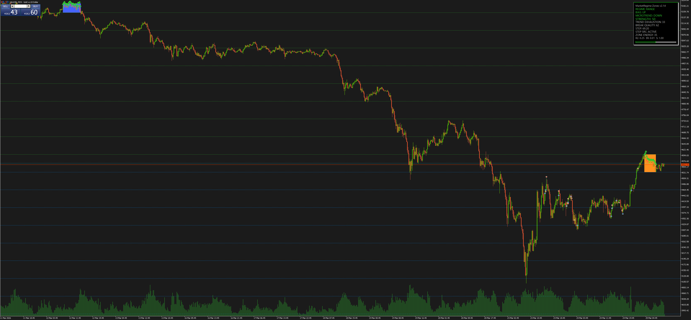

# MarketRegime Zones (v2.14)

MQL5 indicator that classifies the current market regime from price-only statistics, detects ranging zones from lateral clusters, projects horizontal levels, and renders a compact draggable HUD with structural bias, microtrend, strength, trend exhaustion, break quality, step source, and zone energy.

## Feature Summary

- Detects ranging with an objective rule: `|slope_norm| < threshold` and `R2 < InpR2Threshold`.
- Computes linear regression chronologically from the oldest candle in the window to the newest candle, even though MT5 arrays are handled in series mode.
- Builds zones from clusters of ranging candles with three states:
  - active (`Z_ACTIVE`)
  - broken upward (`Z_BREAK_UP`)
  - broken downward (`Z_BREAK_DOWN`)
- Supports two rendering modes:
  - last active zone + last broken zone
  - multi-zone mode limited by `InpMaxZonesOnChart`
- Renders zones with duration-based transparency and border width driven by average range score.
- Optionally extends a zone until breakout and can draw the zone midline.
- Projects horizontal levels from the most relevant recent zone in active-mode rendering.
- Shows a draggable HUD with `REGIME`, `BIAS`, `MICROTREND`, `STRENGTH`, `TREND EXHAUSTION`, `BREAK QUALITY`, `STEP`, `STEP SRC`, `ZONE ENERGY`, and optional `R2 / ER / S`.
- Falls back to a single `DIR` line when `InpShowBiasAndMicrotrend = false`.
- Calculates `TREND STRENGTH` from normalized slope, `R2`, and Efficiency Ratio (`ER`).
- Calculates `TREND EXHAUSTION` from distance to zone mid, short-window strength drop, and short-window noise.
- Calculates `BREAK QUALITY` from trend strength, broken-zone energy, breakout penetration, and freshness.
- Calculates `ZONE ENERGY` only from price statistics: duration, compression, chop, and edge touches.
- Throttles `OnCalculate()` with `InpOnCalculateDelaySeconds` to reduce redraw frequency if needed.

## Quick Start

1. Copy `MarketRegime.mq5` to `MQL5/Indicators/` and compile it in MetaEditor.
2. Attach the indicator to the target chart in MT5.
3. Tune regime sensitivity first:

- `InpWindow`
- `InpSlopeNormMode`
- `InpSlopeThresholdMean` or `InpSlopeThresholdStd`
- `InpR2Threshold`
- `InpScoreSlopeWeight`

4. Tune zone formation and breakout extension:

- `InpMinZoneBars`
- `InpGapTolerance`
- `InpExtendUntilBreak`
- `InpBreakMarginPoints`
- `InpOnlyLastActiveAndLastBroken`

5. Tune projection and HUD behavior:

- `InpDrawProjectionLines`
- `InpProjectionCount`
- `InpEnableTrendHUD`
- `InpShowBiasAndMicrotrend`
- `InpShowTrendDetails`
- `InpMicrotrendWindow`

6. Tune the derived metrics if you use them in discretionary decisions:

- `InpTrendWeightSlope`
- `InpTrendWeightR2`
- `InpTrendWeightER`
- `InpExhaust*`
- `InpBreakQuality*`
- `InpZoneEnergy*`

7. Use `InpDebug` for Journal diagnostics and `InpOnCalculateDelaySeconds` to limit recomputation frequency.

## Regime and HUD Behavior

- `REGIME` is `RANGE` when the current bar is lateral or when a valid active zone exists.
- `REGIME` is `TREND` when no active range is present and `trend_strength >= InpTrendThreshold`.
- Otherwise `REGIME` is `MIXED`.
- `BIAS` uses the main regression window (`InpWindow`).
- `MICROTREND` uses the shorter regression window (`InpMicrotrendWindow`).
- `DIR` replaces `BIAS` and `MICROTREND` when `InpShowBiasAndMicrotrend = false`.
- `STEP` is the current zone height: `top - bottom`.
- `STEP SRC` is `ACTIVE`, `LAST BROKEN`, or `N/A`.
- `ZONE ENERGY` is shown only for the last active zone; if no active zone exists, the HUD shows `N/A`.
- `TREND EXHAUSTION` requires a valid step and short-window metrics from `InpExhaustLookback`.
- `BREAK QUALITY` requires a valid broken zone.
- The extra detail line shows `R2`, `ER`, and normalized slope component `S`.

## Metric Formulas

- `trend_strength` is a normalized weighted sum of:
  - normalized slope
  - `R2`
  - `ER`
- `trend_exhaustion` is a normalized weighted sum of:
  - distance from current price to zone midpoint, measured in zone steps
  - drop from main-window strength to short-window strength
  - short-window noise (`1 - ER`)
- `break_quality` is a normalized weighted sum of:
  - current trend strength
  - broken-zone energy
  - breakout penetration relative to broken-zone step
  - freshness (`1 - trend_exhaustion`)
- `zone_energy` is a normalized weighted sum of:
  - zone duration
  - compression (`1 - range/path`)
  - chop (`1 - ER_zone`)
  - total top/bottom touches

Weights are automatically normalized when their sum differs from `1`.

## Parameters (`input`)

### 1) Regression and Regime

| Parameter | Type | Default | Description |
| --- | --- | ---: | --- |
| `InpWindow` | `int` | `240` | Main linear-regression window in bars. |
| `InpSlopeNormMode` | `ENUM_SLOPE_NORM_MODE` | `SLOPE_NORM_MEAN` | Slope normalization mode: `MEAN` or `STD`. |
| `InpSlopeThresholdMean` | `double` | `0.0001` | Slope threshold used in `MEAN` mode. |
| `InpSlopeThresholdStd` | `double` | `0.20` | Slope threshold used in `STD` mode. |
| `InpR2Threshold` | `double` | `0.05` | Maximum `R2` allowed to classify the window as ranging. |
| `InpScoreSlopeWeight` | `double` | `0.85` | Slope weight in the informational range score; `R2` uses `1 - weight`. |

### 2) Zones

| Parameter | Type | Default | Description |
| --- | --- | ---: | --- |
| `InpMinZoneBars` | `int` | `15` | Minimum number of bars required to validate a zone. |
| `InpGapTolerance` | `int` | `1` | Maximum number of non-ranging bars tolerated inside a zone cluster. |
| `InpExtendUntilBreak` | `bool` | `true` | Extends the zone until a breakout is found. |
| `InpBreakMarginPoints` | `double` | `50` | Breakout confirmation margin in points. |
| `InpMaxZonesOnChart` | `int` | `3` | Maximum number of zones drawn when multi-zone mode is enabled. |
| `InpOnlyLastActiveAndLastBroken` | `bool` | `true` | Keeps only the last active zone and the last broken zone. |

### 3) Zone Visuals

| Parameter | Type | Default | Description |
| --- | --- | ---: | --- |
| `InpKeepArrows` | `bool` | `true` | Draws arrows on ranging candles. |
| `InpDrawMidLine` | `bool` | `false` | Draws the zone midpoint line. |
| `InpAlphaMin` | `int` | `15` | Minimum zone alpha (`0..255`). |
| `InpAlphaMax` | `int` | `50` | Maximum zone alpha (`0..255`). |
| `InpAlphaLenScale` | `int` | `120` | Length scale used to interpolate zone transparency. |
| `InpBorderMinWidth` | `int` | `1` | Minimum zone border width. |
| `InpBorderMaxWidth` | `int` | `4` | Maximum zone border width. |

### 4) Horizontal Projections

| Parameter | Type | Default | Description |
| --- | --- | ---: | --- |
| `InpDrawProjectionLines` | `bool` | `true` | Enables projection lines. |
| `InpProjectionCount` | `int` | `10` | Number of levels above and below the selected zone. |
| `InpProjectionIncludeZoneLevels` | `bool` | `true` | Includes the zone `top`, `mid`, and `bottom` levels. |
| `InpProjectionLineWidth` | `int` | `1` | Projection line thickness. |
| `InpProjectionLineAlpha` | `int` | `10` | Projection line alpha (`0..255`). |
| `InpProjectionLineColor` | `color` | `clrGold` | Color used for the midline projection; directional levels remain green/orange. |

Projection behavior:

- In `InpOnlyLastActiveAndLastBroken = true`, projections use the active zone if present, otherwise the last broken zone.
- In multi-zone mode, projection lines are intentionally cleared instead of selecting one of the rendered zones.

### 5) HUD and Trend Strength

| Parameter | Type | Default | Description |
| --- | --- | ---: | --- |
| `InpEnableTrendHUD` | `bool` | `true` | Enables the HUD. |
| `InpShowTrendDetails` | `bool` | `true` | Shows the extra line with `R2 / ER / S`. |
| `InpShowBiasAndMicrotrend` | `bool` | `true` | Shows separate `BIAS` and `MICROTREND` lines. |
| `InpMicrotrendWindow` | `int` | `30` | Regression window used for the short-term microtrend. |
| `InpHUDDraggable` | `bool` | `true` | Allows dragging the HUD on chart. |
| `InpHUDXDefault` | `int` | `12` | Default HUD X offset. |
| `InpHUDYDefault` | `int` | `12` | Default HUD Y offset. |
| `InpHUDFontSize` | `int` | `10` | HUD font size. |
| `InpHUDWidth` | `int` | `240` | Requested HUD width. |
| `InpHUDHeight` | `int` | `86` | Minimum HUD height. |
| `InpHUDAlphaMin` | `int` | `170` | Minimum HUD alpha (`0..255`). |
| `InpHUDAlphaMax` | `int` | `255` | Maximum HUD alpha (`0..255`). |
| `InpBarHeight` | `int` | `10` | Strength bar height input. |
| `InpBarMarginX` | `int` | `10` | Reserved compatibility input for bar X margin. |
| `InpBarMarginBottom` | `int` | `10` | Reserved compatibility input for bar bottom margin. |
| `InpTrendThreshold` | `double` | `0.60` | Threshold used to classify `TREND` regime. |
| `InpTrendWeightSlope` | `double` | `0.40` | Weight of normalized slope in `trend_strength`. |
| `InpTrendWeightR2` | `double` | `0.40` | Weight of `R2` in `trend_strength`. |
| `InpTrendWeightER` | `double` | `0.20` | Weight of `ER` in `trend_strength`. |

### 6) Trend Exhaustion

| Parameter | Type | Default | Description |
| --- | --- | ---: | --- |
| `InpEnableTrendExhaustion` | `bool` | `true` | Enables the `TREND EXHAUSTION` readout when the metric can be computed. |
| `InpExhaustLookback` | `int` | `20` | Lookback window used for short-term exhaustion metrics. |
| `InpExhaustDistanceScale` | `double` | `3.0` | Distance scale, in zone steps, used to normalize price-to-mid distance. |
| `InpExhaustWeightDistance` | `double` | `0.45` | Weight of zone-mid distance in exhaustion. |
| `InpExhaustWeightStrength` | `double` | `0.30` | Weight of strength drop between main and short windows. |
| `InpExhaustWeightNoise` | `double` | `0.25` | Weight of short-window noise (`1 - ER`). |

### 7) Break Quality

| Parameter | Type | Default | Description |
| --- | --- | ---: | --- |
| `InpEnableBreakQuality` | `bool` | `true` | Enables the `BREAK QUALITY` readout when a broken zone exists. |
| `InpBreakQualityWeightStrength` | `double` | `0.35` | Weight of current trend strength in break quality. |
| `InpBreakQualityWeightEnergy` | `double` | `0.30` | Weight of broken-zone energy in break quality. |
| `InpBreakQualityWeightPenetr` | `double` | `0.20` | Weight of breakout penetration relative to zone step. |
| `InpBreakQualityWeightFresh` | `double` | `0.15` | Weight of freshness (`1 - trend_exhaustion`). |

### 8) Zone Energy

| Parameter | Type | Default | Description |
| --- | --- | ---: | --- |
| `InpEnableZoneEnergy` | `bool` | `true` | Enables calculation and HUD display of `ZONE ENERGY`. |
| `InpZoneEnergyLenScale` | `int` | `120` | Duration scale for the length component. |
| `InpZoneEnergyTouchMarginPoints` | `int` | `30` | Margin in points used to count top/bottom touches. |
| `InpZoneEnergyTouchScale` | `int` | `12` | Touch normalization scale. |
| `InpZoneEnergyWeightLen` | `double` | `0.30` | Duration weight. |
| `InpZoneEnergyWeightComp` | `double` | `0.35` | Compression weight. |
| `InpZoneEnergyWeightChop` | `double` | `0.20` | Chop weight (`1 - ER_zone`). |
| `InpZoneEnergyWeightTouch` | `double` | `0.15` | Edge-touch weight. |

### 9) Execution and Debug

| Parameter | Type | Default | Description |
| --- | --- | ---: | --- |
| `InpDebug` | `bool` | `false` | Enables debug logging in the MT5 Journal. |
| `InpOnCalculateDelaySeconds` | `int` | `5` | Minimum delay between `OnCalculate()` executions; `0` disables throttling. |

## Notes

- The indicator uses only price statistics. It does not depend on moving averages, oscillators, or other classic indicators.
- In `OnInit()`, the code calls `ObjectsDeleteAll(0, -1, -1)`, which clears all objects on the current chart before creating its own HUD and drawing objects.
- The HUD remains draggable and automatically adjusts its height to the number of visible lines.
- The indicator short name shown by MT5 is `MarketRegime Zones (v2.14)`.
