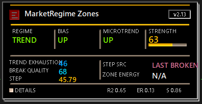
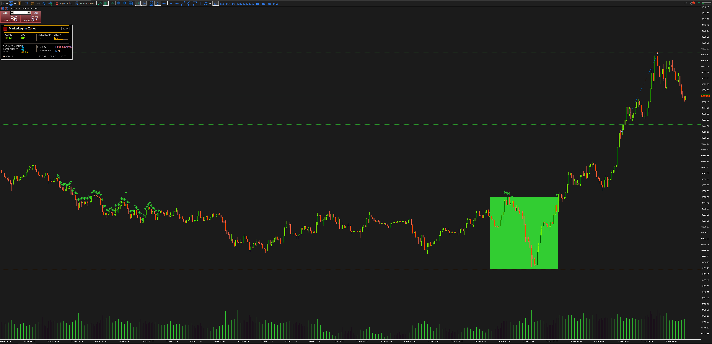

# MarketRegime Zones (v2.15)

A statistical market regime engine for MetaTrader 5 with optional tick-volume confirmation.

MarketRegime Zones is an MQL5 indicator that interprets market structure through price statistics plus an optional tick-volume confirmation layer instead of traditional indicators. It detects ranges, breakouts, structural bias, microtrend, trend strength, exhaustion, breakout quality, and volume participation through projected zones and a compact real-time HUD, making it useful both for discretionary chart reading and for regime-based research workflows.

## Visual Examples

## Highlights

- Statistical price-structure analysis with optional tick-volume confirmation
- Range and breakout zone detection
- Trend strength, exhaustion, and break quality
- Horizontal projection levels from recent zone structure
- Compact premium HUD for FHD multi-chart use
- Standalone historical dataset export script for ML workflows
- Built for discretionary trading and future ML-oriented workflows

## Why it's different

Most MT5 indicators summarize price through moving averages, oscillators, or momentum derivatives. MarketRegime Zones does not. It works from regression, efficiency, clustering, compression, structural zone behavior, and an optional tick-volume participation read to classify the market as a regime state instead of a single signal line. The result is a more structured decision framework for reading whether price is ranging, trending, exhausting, or breaking with quality and participation.

## Feature Summary

- Detects ranging with an objective rule: `|slope_norm| < threshold` and `R2 < InpR2Threshold`.
- Computes linear regression chronologically from the oldest candle in the window to the newest candle, even though MT5 arrays run in series mode.
- Builds zones from clusters of ranging candles with three states: `Z_ACTIVE`, `Z_BREAK_UP`, and `Z_BREAK_DOWN`.
- Supports two rendering modes: last active zone plus last broken zone, or multi-zone rendering limited by `InpMaxZonesOnChart`.
- Renders zones with duration-based transparency and border width driven by average range score.
- Optionally extends a zone until breakout and can draw the zone midline.
- Projects horizontal levels from the most relevant recent zone in active-mode rendering.
- Shows a compact premium HUD with a modern header, four-column top grid, an inline two-column metrics grid with adaptive width, a strength bar, and footer details for `R2 / ER / S`.
- Keeps the dashboard layout stable even when some fields are disabled, using `N/A` instead of collapsing sections.
- Calculates `TREND STRENGTH` from normalized slope, `R2`, and Efficiency Ratio (`ER`).
- Calculates `TREND EXHAUSTION` from distance to zone mid, short-window strength drop, and short-window noise.
- Calculates `BREAK QUALITY` from trend strength, broken-zone energy, breakout penetration, and freshness.
- Calculates `VOLUME CONFIRM` from short-window volume slope, volume `R2`, and short-vs-long volume ratio using `tick_volume` as a participation proxy.
- Calculates `ZONE ENERGY` only from price statistics: duration, compression, chop, and edge touches.
- Throttles `OnCalculate()` with `InpOnCalculateDelaySeconds` to reduce redraw frequency if needed.

## HUD Interpretation

The HUD is designed to be read in a few seconds, not treated as a full control panel. The current layout is a compact premium card tuned for FHD multi-chart setups: header, top grid, a two-column middle metrics grid with inline `LABEL: VALUE` rows, and footer details. The renderer expands the panel width when the middle metrics need more space.

| HUD Field | Quick Interpretation |
| --- | --- |
| `REGIME` | Current structural state: `RANGE`, `TREND`, or `MIXED`. |
| `BIAS` | Main directional bias from the primary regression window; shows `N/A` when the split bias/micro view is disabled. |
| `MICROTREND` | Shorter-window directional read for local flow; shows `N/A` when the split bias/micro view is disabled. |
| `STRENGTH` | Composite trend quality built from slope, `R2`, and `ER`. |
| `TREND EXHAUSTION` | How stretched or tired the current move looks relative to zone structure and short-term deterioration. |
| `BREAK QUALITY` | How credible the last breakout is based on strength, penetration, zone energy, and freshness. |
| `VOLUME BIAS` | Direction of the short-window tick-volume regression: `UP`, `DOWN`, or `NEUTRAL`. |
| `VOLUME CONFIRM` | Composite participation score from volume slope, `R2`, and short-vs-long volume ratio. Low values are a red flag on strong-looking price moves. |
| `STEP` | Current zone height in price terms: `top - bottom`. |
| `STEP SRC` | Whether the current `STEP` comes from the active zone, the last broken zone, or is unavailable. |
| `ZONE ENERGY` | Statistical quality of the active zone based on duration, compression, chop, and edge interaction. |

## Quick Start

1. Copy `MarketRegime.mq5` to `MQL5/Indicators/` and compile it in MetaEditor.
2. Attach the indicator to the target chart in MT5.
3. Tune regime sensitivity first with `InpWindow`, `InpSlopeNormMode`, `InpSlopeThresholdMean`, `InpSlopeThresholdStd`, `InpR2Threshold`, and `InpScoreSlopeWeight`.
4. Tune zone formation and breakout extension with `InpMinZoneBars`, `InpGapTolerance`, `InpExtendUntilBreak`, `InpBreakMarginPoints`, and `InpOnlyLastActiveAndLastBroken`.
5. Tune projection and HUD behavior with `InpDrawProjectionLines`, `InpProjectionCount`, `InpEnableTrendHUD`, `InpShowBiasAndMicrotrend`, `InpShowTrendDetails`, `InpShowVolumeDetails`, and `InpMicrotrendWindow`.
6. Tune the derived metrics if you use them in discretionary decisions: `InpTrendWeight*`, `InpExhaust*`, `InpBreakQuality*`, `InpVolume*`, and `InpZoneEnergy*`.
7. Use `InpDebug` for Journal diagnostics and `InpOnCalculateDelaySeconds` to limit recomputation frequency.

This repository tracks source code only. Compile the indicator locally in MetaEditor when you need the `.ex5` artifact.

## Dataset Export

The repository now includes a standalone historical export script at `Scripts/ExportMarketRegimeDataset.mq5`. It runs manually in MT5, does not depend on the indicator being attached to the chart, does not export from `OnCalculate()`, and reuses the same statistical engine modules used by the indicator.

What the script exports:

- One CSV row per valid historical candle
- Two state snapshots on the same row:
  - `fast` window via `InpWindowFast` (default `120`)
  - `slow` window via `InpWindowSlow` (default `180`)
- Core categorical fields:
  - `regime_*`, `bias_*`, `microtrend_*`, `step_src_*`
- Core numeric fields:
  - `strength_*`, `exhaustion_*`, `break_quality_*`, `step_*`, `zone_energy_*`
- Volume fields:
  - `volume_bias_*`, `volume_confirm_*`, `volume_r2_*`, `volume_ratio_*`, `volume_s_*`
- Derived cross-window features:
  - alignment flags for regime, bias, microtrend, and volume bias
  - deltas for strength, volume confirmation, exhaustion, break quality, step, and zone energy
- Future training labels:
  - `future_move_H = close[i-H] - close[i]`
  - `mfe_H = max(close[i-k] - close[i])`
  - `mae_H = min(close[i-k] - close[i])`

Default export behavior:

- Symbol: `InpExportSymbol`, or `_Symbol` when empty
- Timeframe: `InpExportTimeframe`
- File: `InpExportFileName`
- Folder: common MT5 files folder when `InpUseCommonFolder = true`
- History slice:
  - `InpStartShift` skips the most recent valid rows before export
  - `InpMaxRows = 0` exports the full valid history slice

The script only writes rows that have enough past data for the configured windows and enough future data for the largest label horizon, so it avoids incomplete training rows by construction.

## Regime and HUD Behavior

- `REGIME` is `RANGE` when the current bar is lateral or when a valid active zone exists.
- `REGIME` is `TREND` when no active range is present and `trend_strength >= InpTrendThreshold`.
- Otherwise `REGIME` is `MIXED`.
- `BIAS` uses the main regression window (`InpWindow`).
- `MICROTREND` uses the shorter regression window (`InpMicrotrendWindow`).
- `BIAS` and `MICROTREND` stay in place when `InpShowBiasAndMicrotrend = false`, but render as `N/A` to preserve the dashboard layout.
- `STEP` is the current zone height: `top - bottom`.
- `STEP SRC` is `ACTIVE`, `LAST BROKEN`, or `N/A`.
- `ZONE ENERGY` is shown only for the last active zone; if no active zone exists, the HUD shows `N/A`.
- `TREND EXHAUSTION` requires a valid step and short-window metrics from `InpExhaustLookback`.
- `BREAK QUALITY` requires a valid broken zone.
- `VOLUME BIAS` and `VOLUME CONFIRM` use `tick_volume` only and never feed back into the price-state rules.
- The extra detail line shows `R2`, `ER`, and normalized slope component `S`; when `InpShowVolumeDetails = true`, it also shows `VOL R2`, `VOL RATIO`, and `VOL S`.

## Metric Formulas

- `trend_strength` is a normalized weighted sum of:
  - normalized slope
  - `R2`
  - `ER`
- `trend_exhaustion` is a normalized weighted sum of:
  - distance from current price to zone midpoint, measured in zone steps
  - drop from main-window strength to short-window strength
  - short-window noise (`1 - ER`)
- `break_quality` is a normalized weighted sum of:
  - current trend strength
  - broken-zone energy
  - breakout penetration relative to broken-zone step
  - freshness (`1 - trend_exhaustion`)
- `zone_energy` is a normalized weighted sum of:
  - zone duration
  - compression (`1 - range/path`)
  - chop (`1 - ER_zone`)
  - total top/bottom touches

Weights are automatically normalized when their sum differs from `1`.

- `volume_confirm` is a normalized weighted sum of:
  - short-window normalized volume slope
  - volume `R2`
  - short-vs-long average volume ratio

## Parameters (`input`)

### 1) Regression and Regime

| Parameter | Type | Default | Description |
| --- | --- | ---: | --- |
| `InpWindow` | `int` | `240` | Main linear-regression window in bars. |
| `InpSlopeNormMode` | `ENUM_SLOPE_NORM_MODE` | `SLOPE_NORM_MEAN` | Slope normalization mode: `MEAN` or `STD`. |
| `InpSlopeThresholdMean` | `double` | `0.0001` | Slope threshold used in `MEAN` mode. |
| `InpSlopeThresholdStd` | `double` | `0.20` | Slope threshold used in `STD` mode. |
| `InpR2Threshold` | `double` | `0.05` | Maximum `R2` allowed to classify the window as ranging. |
| `InpScoreSlopeWeight` | `double` | `0.85` | Slope weight in the informational range score; `R2` uses `1 - weight`. |

### 2) Zones

| Parameter | Type | Default | Description |
| --- | --- | ---: | --- |
| `InpMinZoneBars` | `int` | `15` | Minimum number of bars required to validate a zone. |
| `InpGapTolerance` | `int` | `1` | Maximum number of non-ranging bars tolerated inside a zone cluster. |
| `InpExtendUntilBreak` | `bool` | `true` | Extends the zone until a breakout is found. |
| `InpBreakMarginPoints` | `double` | `50` | Breakout confirmation margin in points. |
| `InpMaxZonesOnChart` | `int` | `3` | Maximum number of zones drawn when multi-zone mode is enabled. |
| `InpOnlyLastActiveAndLastBroken` | `bool` | `true` | Keeps only the last active zone and the last broken zone. |

### 3) Zone Visuals

| Parameter | Type | Default | Description |
| --- | --- | ---: | --- |
| `InpKeepArrows` | `bool` | `true` | Draws arrows on ranging candles. |
| `InpDrawMidLine` | `bool` | `false` | Draws the zone midpoint line. |
| `InpAlphaMin` | `int` | `15` | Minimum zone alpha (`0..255`). |
| `InpAlphaMax` | `int` | `50` | Maximum zone alpha (`0..255`). |
| `InpAlphaLenScale` | `int` | `120` | Length scale used to interpolate zone transparency. |
| `InpBorderMinWidth` | `int` | `1` | Minimum zone border width. |
| `InpBorderMaxWidth` | `int` | `4` | Maximum zone border width. |

### 4) Horizontal Projections

| Parameter | Type | Default | Description |
| --- | --- | ---: | --- |
| `InpDrawProjectionLines` | `bool` | `true` | Enables projection lines. |
| `InpProjectionCount` | `int` | `10` | Number of levels above and below the selected zone. |
| `InpProjectionIncludeZoneLevels` | `bool` | `true` | Includes the zone `top`, `mid`, and `bottom` levels. |
| `InpProjectionLineWidth` | `int` | `1` | Projection line thickness. |
| `InpProjectionLineAlpha` | `int` | `10` | Projection line alpha (`0..255`). |
| `InpProjectionLineColor` | `color` | `clrGold` | Color used for the midline projection; directional levels remain green/orange. |

Projection behavior:

- In `InpOnlyLastActiveAndLastBroken = true`, projections use the active zone if present, otherwise the last broken zone.
- In multi-zone mode, projection lines are intentionally cleared instead of selecting one of the rendered zones.

### 5) HUD and Trend Strength

| Parameter | Type | Default | Description |
| --- | --- | ---: | --- |
| `InpEnableTrendHUD` | `bool` | `true` | Enables the HUD. |
| `InpShowTrendDetails` | `bool` | `true` | Shows the extra line with `R2 / ER / S`. |
| `InpShowBiasAndMicrotrend` | `bool` | `true` | Shows separate `BIAS` and `MICROTREND` lines. |
| `InpMicrotrendWindow` | `int` | `30` | Regression window used for the short-term microtrend. |
| `InpHUDDraggable` | `bool` | `true` | Allows dragging the HUD on chart. |
| `InpHUDPersistPosition` | `bool` | `true` | Persists the dragged HUD position through MT5 Global Variables keyed by symbol and timeframe. |
| `InpHUDResetSavedPosition` | `bool` | `false` | Clears the saved HUD position on initialization and restores the default top-right placement. |
| `InpHUDXDefault` | `int` | `12` | Default HUD X offset. |
| `InpHUDYDefault` | `int` | `12` | Default HUD Y offset. |
| `InpHUDFontSize` | `int` | `8` | Base HUD font size for the compact dashboard typography. |
| `InpHUDWidth` | `int` | `384` | Requested HUD width; the renderer scales legacy larger values down, keeps a compact 384 px minimum footprint, and can widen the card when middle-grid content needs more room. |
| `InpHUDHeight` | `int` | `192` | Requested HUD height; the renderer scales legacy larger values down and keeps a compact 192 px minimum footprint. |
| `InpHUDAlphaMin` | `int` | `170` | Minimum HUD alpha (`0..255`). |
| `InpHUDAlphaMax` | `int` | `255` | Maximum HUD alpha (`0..255`). |
| `InpBarHeight` | `int` | `7` | Strength bar height input for the compact HUD. |
| `InpBarMarginX` | `int` | `10` | Reserved compatibility input for bar X margin. |
| `InpBarMarginBottom` | `int` | `10` | Reserved compatibility input for bar bottom margin. |
| `InpTrendThreshold` | `double` | `0.60` | Threshold used to classify `TREND` regime. |
| `InpTrendWeightSlope` | `double` | `0.40` | Weight of normalized slope in `trend_strength`. |
| `InpTrendWeightR2` | `double` | `0.40` | Weight of `R2` in `trend_strength`. |
| `InpTrendWeightER` | `double` | `0.20` | Weight of `ER` in `trend_strength`. |

HUD position persistence:

- The HUD still spawns in the default top-right position until the user drags it.
- When `InpHUDPersistPosition = true`, the indicator stores `X`, `Y`, and `MOVED` flags in MT5 Global Variables using keys such as `MRZ_HUD_X_<SYMBOL>_<PERIOD>`.
- Saved positions are isolated per symbol and timeframe, restored on the next load, and clamped back into the visible chart area if the chart size changes.
- `InpHUDResetSavedPosition = true` acts as a reset-on-init switch; after clearing the stored position, leave it back at `false` if you want persistence to resume on the next initialization.

### 6) Volume Confirmation

| Parameter | Type | Default | Description |
| --- | --- | ---: | --- |
| `InpEnableVolumeConfirmation` | `bool` | `true` | Enables `VOLUME BIAS` and `VOLUME CONFIRM` using `tick_volume`. |
| `InpVolumeWindowShort` | `int` | `20` | Short volume window used for regression and short average. |
| `InpVolumeWindowLong` | `int` | `60` | Long volume window used for the participation ratio baseline. |
| `InpVolumeWeightSlope` | `double` | `0.40` | Weight of normalized volume slope in `volume_confirm`. |
| `InpVolumeWeightR2` | `double` | `0.20` | Weight of volume `R2` in `volume_confirm`. |
| `InpVolumeWeightRatio` | `double` | `0.40` | Weight of short-vs-long volume ratio in `volume_confirm`. |
| `InpVolumeRatioScale` | `double` | `1.5` | Scale used to normalize the short-vs-long volume ratio. |
| `InpVolumeSlopeThreshold` | `double` | `0.10` | Threshold used to normalize short-window volume slope. |
| `InpShowVolumeDetails` | `bool` | `false` | Adds `VOL R2`, `VOL RATIO`, and `VOL S` to the HUD details footer. |

### 7) Trend Exhaustion

| Parameter | Type | Default | Description |
| --- | --- | ---: | --- |
| `InpEnableTrendExhaustion` | `bool` | `true` | Enables the `TREND EXHAUSTION` readout when the metric can be computed. |
| `InpExhaustLookback` | `int` | `20` | Lookback window used for short-term exhaustion metrics. |
| `InpExhaustDistanceScale` | `double` | `3.0` | Distance scale, in zone steps, used to normalize price-to-mid distance. |
| `InpExhaustWeightDistance` | `double` | `0.45` | Weight of zone-mid distance in exhaustion. |
| `InpExhaustWeightStrength` | `double` | `0.30` | Weight of strength drop between main and short windows. |
| `InpExhaustWeightNoise` | `double` | `0.25` | Weight of short-window noise (`1 - ER`). |

### 8) Break Quality

| Parameter | Type | Default | Description |
| --- | --- | ---: | --- |
| `InpEnableBreakQuality` | `bool` | `true` | Enables the `BREAK QUALITY` readout when a broken zone exists. |
| `InpBreakQualityWeightStrength` | `double` | `0.35` | Weight of current trend strength in break quality. |
| `InpBreakQualityWeightEnergy` | `double` | `0.30` | Weight of broken-zone energy in break quality. |
| `InpBreakQualityWeightPenetr` | `double` | `0.20` | Weight of breakout penetration relative to zone step. |
| `InpBreakQualityWeightFresh` | `double` | `0.15` | Weight of freshness (`1 - trend_exhaustion`). |

### 9) Zone Energy

| Parameter | Type | Default | Description |
| --- | --- | ---: | --- |
| `InpEnableZoneEnergy` | `bool` | `true` | Enables calculation and HUD display of `ZONE ENERGY`. |
| `InpZoneEnergyLenScale` | `int` | `120` | Duration scale for the length component. |
| `InpZoneEnergyTouchMarginPoints` | `int` | `30` | Margin in points used to count top/bottom touches. |
| `InpZoneEnergyTouchScale` | `int` | `12` | Touch normalization scale. |
| `InpZoneEnergyWeightLen` | `double` | `0.30` | Duration weight. |
| `InpZoneEnergyWeightComp` | `double` | `0.35` | Compression weight. |
| `InpZoneEnergyWeightChop` | `double` | `0.20` | Chop weight (`1 - ER_zone`). |
| `InpZoneEnergyWeightTouch` | `double` | `0.15` | Edge-touch weight. |

### 10) Execution and Debug

| Parameter | Type | Default | Description |
| --- | --- | ---: | --- |
| `InpDebug` | `bool` | `false` | Enables debug logging in the MT5 Journal. |
| `InpOnCalculateDelaySeconds` | `int` | `5` | Minimum delay between `OnCalculate()` executions; `0` disables throttling. |

## Project Structure

- `MarketRegime.mq5`: indicator entry point and orchestration.
- `Core/`: shared types and helpers.
- `HUD/`: layout, rendering, and drag behavior for the on-chart HUD.
- `Stats/`: derived metrics such as trend strength, exhaustion, break quality, volume confirmation, and zone energy.
- `Zones/`: range detection, projection logic, and zone rendering.

## Notes

- The indicator logic still depends on price statistics for regime, zones, projections, and all existing structural metrics; the volume layer is additive and uses `tick_volume` only for confirmation.
- In `OnInit()`, the code calls `ObjectsDeleteAll(0, -1, -1)`, which clears all objects on the current chart before creating its own HUD and drawing objects.
- The HUD remains draggable only from the main background card, moves every child object together, and persists its dragged position through MT5 Global Variables.
- The indicator short name shown by MT5 is `MarketRegime Zones (v2.15)`.

## Roadmap / Next Steps

- Dataset export for ML-oriented regime labeling and analysis
- EA integration hooks for state-aware execution workflows
- Multi-window or multi-scale regime analysis
- State-based automation experiments built on the existing regime model
