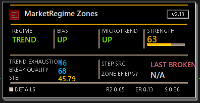
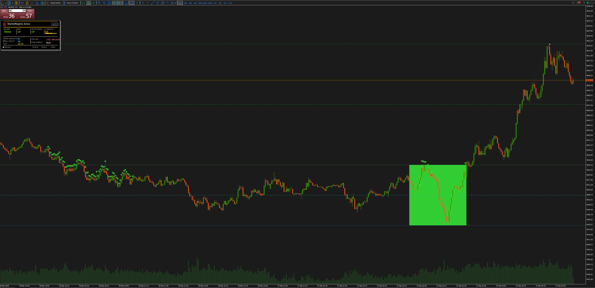

# MarketRegime Zones (v2.17)

A statistical market regime engine for MetaTrader 5 with optional tick-volume confirmation.

MarketRegime Zones is an MQL5 indicator that interprets market structure through price statistics plus an optional tick-volume confirmation layer instead of traditional indicators. It detects ranges, breakouts, structural bias, microtrend, trend strength, exhaustion, breakout quality, and volume participation through projected zones and a compact real-time HUD, making it useful both for discretionary chart reading and for regime-based research workflows.

## Visual Examples





## Highlights

- Statistical price-structure analysis with optional tick-volume confirmation
- Range and breakout zone detection
- Trend strength, exhaustion, and break quality
- Horizontal projection levels from recent zone structure
- Compact premium HUD for FHD multi-chart use
- Standalone historical dataset export script for ML workflows
- Event-based XAUUSD breakout export with cost-aware, indicator-driven labels
- Candle-by-candle exit-path export for mapping HUD reversals and calibrating exits
- Closed-candle breakout events and manual decision logging directly in the HUD
- Built for discretionary trading and future ML-oriented workflows

## Why it's different

Most MT5 indicators summarize price through moving averages, oscillators, or momentum derivatives. MarketRegime Zones does not. It works from regression, efficiency, clustering, compression, structural zone behavior, and an optional tick-volume participation read to classify the market as a regime state instead of a single signal line. The result is a more structured decision framework for reading whether price is ranging, trending, exhausting, or breaking with quality and participation.

## Feature Summary

- Detects ranging with an objective rule: `|slope_norm| < threshold` and `R2 < InpR2Threshold`.
- Computes linear regression chronologically from the oldest candle in the window to the newest candle, even though MT5 arrays run in series mode.
- Builds zones from clusters of ranging candles with three states: `Z_ACTIVE`, `Z_BREAK_UP`, and `Z_BREAK_DOWN`.
- Supports two rendering modes: last active zone plus last broken zone, or multi-zone rendering limited by `InpMaxZonesOnChart`.
- Renders zones with duration-based transparency and border width driven by average range score.
- Optionally extends a zone until breakout and can draw the zone midline.
- Projects horizontal levels from the most relevant recent zone in active-mode rendering.
- Shows a compact premium HUD with a modern header, four-column top grid, an inline two-column metrics grid with adaptive width, a strength bar, footer details for `R2 / ER / S`, and an optional human-decision event section.
- Keeps the dashboard layout stable even when some fields are disabled, using `N/A` instead of collapsing sections.
- Calculates `TREND STRENGTH` from normalized slope, `R2`, and Efficiency Ratio (`ER`).
- Calculates `TREND EXHAUSTION` from distance to zone mid, short-window strength drop, and short-window noise.
- Calculates `BREAK QUALITY` from trend strength, broken-zone energy, breakout penetration, and freshness.
- Calculates `VOLUME CONFIRM` from short-window volume slope, volume `R2`, and short-vs-long volume ratio using `tick_volume` as a participation proxy.
- Calculates `ZONE ENERGY` only from price statistics: duration, compression, chop, and edge touches.
- Throttles `OnCalculate()` with `InpOnCalculateDelaySeconds` to reduce redraw frequency if needed.

## HUD Interpretation

The HUD is designed to be read in a few seconds, not treated as a full control panel. The current layout is a compact premium card tuned for FHD multi-chart setups: header, top grid, a two-column middle metrics grid with inline `LABEL: VALUE` rows, and footer details. The renderer expands the panel width when the middle metrics need more space.

| HUD Field | Quick Interpretation |
| --- | --- |
| `REGIME` | Current structural state: `RANGE`, `TREND`, or `MIXED`. |
| `BIAS` | Main directional bias from the primary regression window; shows `N/A` when the split bias/micro view is disabled. |
| `MICROTREND` | Shorter-window directional read for local flow; shows `N/A` when the split bias/micro view is disabled. |
| `STRENGTH` | Composite trend quality built from slope, `R2`, and `ER`. |
| `TREND EXHAUSTION` | How stretched or tired the current move looks relative to zone structure and short-term deterioration. |
| `BREAK QUALITY` | How credible the last breakout is based on strength, penetration, zone energy, and freshness. |
| `VOLUME BIAS` | Direction of the short-window tick-volume regression: `UP`, `DOWN`, or `NEUTRAL`. |
| `VOLUME CONFIRM` | Composite participation score from volume slope, `R2`, and short-vs-long volume ratio. Low values are a red flag on strong-looking price moves. |
| `STEP` | Current zone height in price terms: `top - bottom`. |
| `STEP SRC` | Whether the current `STEP` comes from the active zone, the last broken zone, or is unavailable. |
| `ZONE ENERGY` | Statistical quality of the active zone based on duration, compression, chop, and edge interaction. |

### Human-Decision Events

With `InpEnableDecisionEvents = true`, the lower HUD section watches only the last completed candle and classifies a recent broken-zone setup as `IMMEDIATE`, `RETEST`, or `CONTINUATION`. It never treats the forming candle as a confirmed event.

The section presents:

- Direction (`COMPRA` or `VENDA`), event age, and state (`NOVO`, `EM AVALIACAO`, `INVALIDADO`, or `EXPIRADO`).
- An evidence count built from bias, microtrend, strength, break quality, and optional volume confirmation.
- Objective risk flags for return to the zone, opposing flow, exhaustion, and an optional maximum spread.
- A deliberately non-executing synthesis: `AVALIAR`, `AGUARDAR`, or `EVITAR`.
- `MARCAR ENTRADA` and `IGNORAR` buttons. They only append the human choice and the event/HUD snapshot to a CSV; they do not open, modify, or close positions.

By default, manual decisions are written to terminal-local `MQL5/Files/market_regime_human_decisions.csv`. One decision is accepted per event key, and popup/sound alerts are independently configurable. The indicator contains no order-submission routine.

## Quick Start

1. Copy `MarketRegime.mq5` to `MQL5/Indicators/` and compile it in MetaEditor.
2. Attach the indicator to the target chart in MT5.
3. Tune regime sensitivity first with `InpWindow`, `InpSlopeNormMode`, `InpSlopeThresholdMean`, `InpSlopeThresholdStd`, `InpR2Threshold`, and `InpScoreSlopeWeight`.
4. Tune zone formation and breakout extension with `InpMinZoneBars`, `InpGapTolerance`, `InpExtendUntilBreak`, `InpBreakMarginPoints`, and `InpOnlyLastActiveAndLastBroken`.
5. Tune projection and HUD behavior with `InpDrawProjectionLines`, `InpProjectionCount`, `InpEnableTrendHUD`, `InpShowBiasAndMicrotrend`, `InpShowTrendDetails`, `InpShowVolumeDetails`, and `InpMicrotrendWindow`.
6. Keep `InpEnableDecisionEvents = true` to receive closed-candle events; use `MARCAR ENTRADA` or `IGNORAR` to build the manual decision log.
7. Tune the derived metrics if you use them in discretionary decisions: `InpTrendWeight*`, `InpExhaust*`, `InpBreakQuality*`, `InpVolume*`, and `InpZoneEnergy*`.
8. Use `InpDebug` for Journal diagnostics and `InpOnCalculateDelaySeconds` to limit recomputation frequency.

This repository tracks source code only. Compile the indicator locally in MetaEditor when you need the `.ex5` artifact.

## Dataset Export

The repository now includes a standalone historical export script at `Scripts/ExportMarketRegimeDataset.mq5`. It runs manually in MT5, does not depend on the indicator being attached to the chart, does not export from `OnCalculate()`, and reuses the same statistical engine modules used by the indicator.

What the script exports:

- One CSV row per valid historical candle
- Two state snapshots on the same row:
  - `fast` window via `InpWindowFast` (default `120`)
  - `slow` window via `InpWindowSlow` (default `180`)
- Core categorical fields:
  - `regime_*`, `bias_*`, `microtrend_*`, `step_src_*`
- Core numeric fields:
  - `strength_*`, `exhaustion_*`, `break_quality_*`, `step_*`, `zone_energy_*`
- Volume fields:
  - `volume_bias_*`, `volume_confirm_*`, `volume_r2_*`, `volume_ratio_*`, `volume_s_*`
- Derived cross-window features:
  - alignment flags for regime, bias, microtrend, and volume bias
  - deltas for strength, volume confirmation, exhaustion, break quality, step, and zone energy
- Future training labels:
  - `future_move_H = close[i-H] - close[i]`
  - `mfe_H = max(close[i-k] - close[i])`
  - `mae_H = min(close[i-k] - close[i])`

Default export behavior:

- Symbol: `InpExportSymbol`, or `_Symbol` when empty
- Timeframe: `InpExportTimeframe`
- File: `InpExportFileName`
- Folder: common MT5 files folder when `InpUseCommonFolder = true`
- History slice:
  - `InpStartShift` skips the most recent valid rows before export
  - `InpMaxRows = 0` exports the full valid history slice

The script only writes rows that have enough past data for the configured windows and enough future data for the largest label horizon, so it avoids incomplete training rows by construction.

## XAUUSD Breakout ML Dataset

`Scripts/ExportXAUUSDBreakoutMLDataset.mq5` is a second, event-based exporter designed for breakout meta-labeling. It preserves the candle-by-candle exporter above and creates a separate dataset in which each row is an actionable XAUUSD breakout candidate rather than an arbitrary historical candle.

Default scope:

- Symbol: `XAUUSD`; change `InpExportSymbol` when the broker uses a suffix or a different gold symbol
- Timeframe: `M1`
- Requested history: `500000` bars via `InpRequestedBars`; use `0` to reuse only the bars currently available to the terminal
- State windows: fast `120`, slow `180`
- Signal kinds: `IMMEDIATE`, `CONTINUATION`, and `RETEST`
- Output: terminal-local `MQL5/Files/xauusd_breakout_ml_events.csv`
- Duplicate control: at most one event of each signal kind per broken zone by default

Cost-aware breakout label:

- The signal is evaluated at the close of bar `t`
- Entry is simulated at the open of `t+1`
- Historical spread and `InpSlippagePoints` are included in entry/exit prices
- Stop and target are expressed as multiples of the broken-zone `step`
- `InpMaxHoldBars` is the vertical time barrier
- If stop and target are both touched in the same candle, the stop wins conservatively and `label_ambiguous_bar` is set to `1`
- Optional indicator exits are confirmed at a candle close and executed at the next candle open, so the label does not use an intrabar state that would be unavailable in real time
- `label_success = 1` when the final result is positive after costs; `label_target_hit` separately records whether the fixed target was reached

Optional indicator-exit rules:

- `InpEnableIndicatorExit = false` by default. The fixed stop, target, and time barrier remain the reference labels until an indicator exit passes chronological validation.
- When enabled, the default candidate is structural invalidation at `0.50 * step`; flow and exhaustion exits are independently configurable and disabled by default.
- `STRUCTURE`: exit after price closes back inside the broken zone by at least `InpExitInsideZoneStepFraction * step`
- `FLOW_REVERSAL`: exit when both the main bias and microtrend oppose the trade direction
- `EXHAUSTION_REVERSAL`: exit when the microtrend opposes the trade and trend exhaustion is at or above `InpExitExhaustionThreshold`
- `InpIndicatorExitMinHoldBars` prevents the indicator rule from firing before the configured number of completed candles
- Stop and target retain intrabar priority; `TIMEOUT` remains only as a final safety limit

The CSV uses column prefixes to make leakage control explicit:

- `meta_*`: event identity and audit context; do not use as model inputs without review
- `feature_*`: values known when the signal candle closes; these are the candidate model inputs
- `label_*`: future execution outcome; `label_success` is the primary profitability target and `label_target_hit` keeps the stricter target-first outcome available for comparison

Feature groups include fast/slow regime state, alignments and deltas, returns normalized by zone step, candle anatomy, ATR, realized volatility, tick-volume z-score, signal spread, distance from the broken boundary, directional distance from zone mid, zone duration/touches/path, and server time fields. Optional unavailable state values use `-999.0`.

Recommended workflow:

1. Compile and run `ExportXAUUSDBreakoutMLDataset.mq5` as an MT5 script.
2. Confirm the symbol name, execution costs, stop/target multiples, and maximum holding period before exporting.
   Ensure the MT5 `Max. bars in chart` setting is at least as large as `InpRequestedBars`; the current research setup uses `2000000` as the terminal limit.
3. Train only with selected `feature_*` columns and use `label_success` as the initial target.
4. Split train/validation/test chronologically and purge overlapping events around each boundary by at least the configured holding horizon.
5. Keep `meta_*` and the remaining `label_*` columns for diagnostics, cost analysis, MFE/MAE analysis, and backtest reconciliation.

### Exit-Path Dataset and HUD Reversal Analysis

The same breakout exporter can also create `MQL5/Files/xauusd_breakout_exit_path.csv` when `InpExportExitPath = true`. Unlike the entry-event CSV, this file contains one row for every actionable closed candle while an event remains open under the fixed stop/target/time-barrier baseline. The default filename is configurable through `InpExitPathFileName`.

Each row respects the real execution sequence:

- HUD and price-path features are observed only after the decision candle closes.
- A candidate exit is executed at the next candle open. Its realized price, historical spread, and cost-aware result are kept as `label_action_*` values because they are not yet known when the decision candle closes.
- Running MFE, MAE, giveback from MFE, distances from the broken zone, candle anatomy, fast/slow HUD state, cross-speed alignment, and changes from both entry and the previous candle are stored as `feature_*` values.
- Baseline result, best future actionable exit, action advantage, regret, and the historical peak row are stored only as `label_*` diagnostics. They must never be used as live rule inputs.
- Events that hit a barrier in the entry candle have no completed post-entry decision candle and therefore correctly produce no exit-path row.

Run the chronological research analysis with:

```bash
.venv/bin/python ML/analyze_exit_hud_reversals.py
```

`ML/analyze_exit_hud_reversals.py` maps fast/slow HUD values from two candles before through two candles after the best actionable exit. It then calibrates two interpretable rule families on an older 90-day window and validates them on the following non-overlapping 90 days: a price-path MFE/giveback control and the same control gated by HUD reversal votes. This comparison isolates whether the HUD adds useful exit information beyond a generic trailing rule. Every trigger still executes at the next open. The report is written under `ML/artifacts/exit_hud/`, is research-only, and always leaves `approved_for_mt5 = false` until unseen-window consistency and a later demo forward test justify implementation.

Two additional research checks are available:

```bash
.venv/bin/python ML/train_exit_policy_model.py
```

This event-grouped classifier tries to distinguish an exit that will improve the fixed baseline by at least `0.05 step` from a temporary pullback that later reaches the target. Events receive equal total training weight, inner folds and outer windows are chronological, and next-open execution fields remain labels. It exports a JSON report only, never an ONNX trading candidate.

For an intrabar protection test, compile and run the lightweight `Scripts/ExportXAUUSDRates.mq5` exporter and then run:

```bash
.venv/bin/python ML/analyze_hud_armed_trailing.py
```

The rates exporter writes `MQL5/Files/xauusd_m1_rates.csv`. The analyzer lets the completed-candle HUD arm a protective trailing stop for the next candle and uses raw OHLC only to simulate whether the stop was hit. Gaps execute at the next open, the stop never loosens, and a stop wins conservatively when stop and target are both possible in one candle. Rule selection maximizes the minimum result across three chronological subperiods inside the 90-day training window before evaluating the next 90 days.

Current exit-path research from `52,554` actionable decisions across `3,663` events:

- The reversal map contains `1,220` events with at least `0.10 step` of recoverable advantage. From the best actionable decision to the following candle, median giveback increases by `0.1651 step`, the directional candle body changes by `-0.2970 step`, directional close location changes by `-0.6175`, and fast break-quality change is `-0.0571`. The HUD clearly confirms deterioration, but much of the return has already occurred by that close.
- A close-confirmed MFE/giveback plus HUD-vote exit improved only `2/4` unseen windows. Pooled PF fell from `0.9601` to `0.9301`, with `-0.00538 step` average degradation versus the fixed baseline.
- The event-grouped exit classifier improved only `1/4` windows. Pooled PF was `0.9114`, with `-0.00932 step` average degradation. It still cut too many pullbacks that later reached the target.
- A price-only trailing stop was also negative. The robust HUD-armed trailing mechanism improved `3/4` windows, reduced pooled drawdown from `49.84` to `35.72 steps`, and raised PF from `0.9601` to `0.9638`, but its most recent window still lost `0.00389 step` per event versus the baseline.

The evidence supports using the HUD to arm price protection rather than issuing a delayed market exit, but the improvement is not yet stable enough for MT5 integration. All three reports remain `approved_for_mt5 = false`; the fixed stop/target/timeout baseline stays active while the exit hypothesis is redesigned or tested on genuinely new demo data.

### Python ML Environment

The repository keeps its training dependencies in `requirements-ml.txt` and ignores the local `.venv` directory. Create or restore the isolated environment with:

```bash
python3 -m venv .venv
.venv/bin/python -m pip install --upgrade pip setuptools wheel
.venv/bin/python -m pip install -r requirements-ml.txt
```

The environment includes the NumPy/Pandas/SciPy/Scikit-learn stack, Joblib serialization, Matplotlib diagnostics, PyArrow I/O, and the ONNX, ONNX Runtime, and `skl2onnx` packages needed to validate model conversion before MetaTrader integration. The current setup has been smoke-tested against the event CSV through training, Joblib serialization, ONNX conversion, and ONNX Runtime inference.

Run the research training pipeline with:

```bash
.venv/bin/python ML/train_breakout_model.py
```

`ML/train_breakout_model.py` uses only `feature_*` inputs, orders events chronologically, purges labels that overlap split boundaries, compares regularized linear and tree ensembles, chooses the probability threshold on validation economics, and inspects the final test only after model and threshold selection. Generated reports, holdout predictions, plots, Joblib models, and ONNX candidates go to the Git-ignored `ML/artifacts/latest` directory.

Current research result for the event dataset ending on `2026-07-31`:

- Purged split: `2,221` train, `741` validation, and `741` final-test events
- Validation selected logistic regression with probability threshold `0.62586212`
- Final test: ROC AUC `0.4842`, `94` selected events, profit factor `0.6663`, and average net step return `-0.1032`
- The candidate failed four approval checks and is explicitly marked `approved_for_mt5 = false`; the ONNX file is a research artifact and must not be connected to trading logic

### Rolling 90-Day Training and Validation

For a regime-focused retrospective test without waiting for new data, run:

```bash
.venv/bin/python ML/train_rolling_90d_model.py
```

The script anchors itself to the newest completed event in the CSV and creates two consecutive calendar windows. It trains on the older 90 days and validates once on the most recent 90 days. Model family and threshold selection use only three expanding folds inside the training window, and labels crossing a temporal boundary are purged. The final validation window is never used to choose another model or threshold.

Current rolling result:

- Training: `645` events from `2026-02-02` through `2026-05-01`
- Validation: `607` events from `2026-05-04` through `2026-07-31`
- Training-only selection: logistic regression at probability threshold `0.695`
- Final validation: ROC AUC `0.4925`, `58` selected events, `37.93%` precision, profit factor `0.9323`, and `-0.1182` average net step return
- Five of six validation checks failed, so the run is rejected, `approved_for_mt5 = false`, and no current demo candidate is exported

If a future rolling run passes all frozen checks, the same selected model family is refit on the latest 90-day window and exported as a demo-only candidate. A failed final window must not be reused to select a replacement model; doing so would turn validation into training.

To diagnose stability across every complete non-overlapping 90-day validation period available in the CSV, run:

```bash
.venv/bin/python ML/analyze_rolling_90d_history.py
```

The nested historical analysis currently contains four `90-day train -> 90-day validation` pairs covering validation periods from August 2025 through July 2026. Each pair independently selects its model and threshold inside its training window. No pair passed all validation gates: validation AUC ranged from `0.4754` to `0.5099`, and profit factor ranged from `0.8239` to `1.1062`.

Across the four non-overlapping validation windows, the models selected `962/2,528` events and produced profit factor `0.8779` with `-0.0392` average net step return. This is worse than the unfiltered event baseline at profit factor `1.0455` and `-0.0156` average net step return. Selected buys were close to flat (`PF 1.0252`, `+0.0114` step), while selected sells were materially negative (`PF 0.7260`, `-0.1260` step). Timeout exits were also negative (`PF 0.7319`). No feature appeared in the top ten in all four windows; `feature_r2_slow` was the most recurrent at three appearances.

The multi-window evidence therefore points to unstable feature/target relationships and an exit problem, especially for sells and timeouts. It does not support deploying the current classifier. The report is written to `ML/artifacts/rolling_90d_history/rolling_history_report.json` and no model artifact is exported.

### Temporal Stability and Prospective Holdout

The failed final test has already been observed and cannot be reused to approve another model. Diagnose its temporal instability with:

```bash
.venv/bin/python ML/analyze_temporal_stability.py
```

The current report found `11/54` features with maximum PSI above `0.10`, `6/54` above `0.25`, and `30/54` train-to-test directional flips. No feature kept the same direction across all three periods with a minimum univariate AUC edge of `0.02`. These results explain why a validation-positive model did not generalize and are diagnostics only, not a new tuning target.

The already-observed history can still be used as development data with expanding walk-forward validation:

```bash
.venv/bin/python ML/train_walk_forward_candidate.py
```

The frozen development candidate is a random forest using the `10` features whose univariate direction remained stable. Across four forward validation folds, its AUCs were `0.5564`, `0.5283`, `0.5250`, and `0.5220`; every fold had positive average net step return and the minimum fold profit factor was `1.1540`. At the locked probability threshold `0.54734996`, the combined out-of-fold result selected `333/2,219` events (`15.01%` coverage), with `55.26%` precision, `1.4962` profit factor, and `+0.0571` average net step return. These are development results, not an independent final test.

`ML/prospective_candidate_manifest.json` locks the development CSV hash and cutoff, training-script hash, feature names and order, random-forest parameters, threshold, walk-forward metrics, and Joblib/ONNX/schema hashes. The candidate remains `approved_for_mt5 = false` and must not be connected to trading logic while it waits for prospective evaluation.

For a stricter independent future study, `ML/prospective_holdout_manifest.json` freezes a holdout after `2026-07-31 20:16`. It requires at least `500` new completed events and `60` calendar days before one-time evaluation. This protocol is separate from the rolling 90-day retrospective test and does not block running that test. Check accumulation with:

```bash
.venv/bin/python ML/check_prospective_holdout.py
```

The checker deliberately reads only `meta_schema_version` and `meta_signal_time`; it does not read any future `label_*` value while the holdout is collecting. It also verifies that the frozen training script and candidate artifacts still match their locked hashes. Periodically rerun the MT5 exporter and then this checker. Do not inspect future outcomes, select features, or change thresholds from that prospective period before both gates pass.

The approval criteria are also frozen before any prospective label is read: ROC AUC at least `0.52`, at least `50` selected events, coverage at least `10%`, precision at least `52%`, profit factor at least `1.10`, and positive average net step return. Once the checker reports `ready_for_one_time_evaluation`, run exactly once:

```bash
.venv/bin/python ML/evaluate_prospective_candidate.py
```

Before readiness, the evaluator exits with code `2`, prints `labels_read=false`, and creates no receipt. When ready, it applies the locked ONNX model, feature order, and threshold without fitting or threshold search, then creates `ML/prospective_evaluation_receipt.json` with exclusive-write protection. Passing makes the candidate eligible only for a subsequent demo forward test; it never approves live trading automatically. Failure rejects this frozen candidate without retuning from the holdout and requires a new future holdout for a redesigned model.

The exporter deliberately emits unfiltered breakout candidates. Existing strength, break-quality, exhaustion, volume, and regime values are features for the model to evaluate instead of hard gates that would remove negative examples before training.

## Breakout Research Backtest

The repository also includes a standalone research script at `Scripts/BacktestMarketRegimeBreakout.mq5`. This script is not an EA and does not place orders. It reconstructs historical `StateSnapshot` values through `Core/StateEngine.mqh`, generates breakout-continuation signals on closed bars only, simulates one position at a time, applies spread plus configurable slippage, and exports a CSV of completed trades.

Research modes:

- `BREAKOUT_MODE_SIMPLE`: fresh zone breakout baseline using `lastBroken` plus `STEP SRC = LAST BROKEN`
- `BREAKOUT_MODE_FILTERED`: breakout continuation filtered by `regime`, `bias`, `strength`, `break_quality`, `exhaustion`, `volume_bias`, and `volume_confirm`
- `BREAKOUT_MODE_BOTH`: runs both baselines in the same script execution and writes a `mode` column in the trade CSV

Automation:

- `InpUseCommonFolder = false` by default, so exports now go to the terminal-local `MQL5/Files` folder unless you explicitly switch back to the common folder.
- `InpRunExperimentSuite = true` enables an internal experiment runner.
- `InpBacktestTimeframe = PERIOD_M1` is now the default for the breakout research script.
- `InpSuiteName = "v8"` is the current validation suite and produces the matching no-indicator-exit baseline on the complete available history.
- `InpSuiteName = "v7"` isolates the `0.50 * step` structural-exit candidate for comparison over the common overlapping history.
- `InpSuiteName = "v2"` remains available if you want to rerun the previous experiment set.
- `InpSuiteName = "v3"` remains available if you want to rerun the previous refinement set.
- Suites `v4`, `v5`, and `v6` remain available for density, recent-window exit, and component comparisons.
- `InpExportSummaryFileName` writes a consolidated CSV summary with one row per experiment, including thresholds and aggregate metrics.
- Each suite experiment still writes its own trade-level CSV, so you get both per-trade detail and a summary table in one script execution.

High-density breakout logic:

- `IMMEDIATE`: breakout on the current bar
- `CONTINUATION`: breakout happened recently and price is still extending beyond the broken zone
- `RETEST`: breakout happened recently and price retests the broken boundary before resuming

The script now labels each trade with `signal_kind` so you can measure which subtype carries the edge and which one only adds noise.

Core execution rules:

- Signal is evaluated on the close of bar `i`
- Entry happens on the open of the next bar in chronological time
- Stop and target are expressed as multiples of `step`
- If stop and target are both touched in the same bar, the script resolves the ambiguity conservatively by assuming the stop happens first
- Indicator exits use the same `STRUCTURE`, `FLOW_REVERSAL`, and `EXHAUSTION_REVERSAL` rules as the ML exporter and execute at the next bar open
- Time-based exits use `InpMaxHoldBars` as a final safety limit

Minimum outputs:

- trade CSV with signal time, entry/exit time, direction, stop/target, exit reason, and gross/net PnL in price units and points
- Journal summary with trade count, win rate, expectancy, payoff, profit factor, max drawdown, and max losing streak

This script is intended for hypothesis testing and baseline comparison, not for live execution.

The complete-history structural result is kept separate from the complete-history baseline so an interrupted multi-experiment run cannot silently leave unlike date ranges in the comparison. Always verify the first and last trade timestamps before comparing the two output files.

Current exit validation on the common overlapping interval from `2024-08-05 12:17` through `2026-07-31 20:15`:

- No indicator exit: `1,615` trades, `45.82%` positive, `-10.43` average net points, profit factor `0.947`, and `26,482.60` points maximum drawdown.
- Structural exit at `0.50 * step`: `1,615` trades, `45.63%` positive, `-12.68` average net points, profit factor `0.936`, and `30,481.40` points maximum drawdown.
- The structural rule made net result, expectancy, profit factor, and drawdown worse, so `InpEnableIndicatorExit` remains disabled by default.
- The raw V8 summary contains one additional `DATA_END` trade on `2026-08-03`, after the V7 cutoff. That `+28`-point incomplete-horizon trade is intentionally excluded from the like-for-like comparison above.

## Regime and HUD Behavior

- `REGIME` is `RANGE` when the current bar is lateral or when a valid active zone exists.
- `REGIME` is `TREND` when no active range is present and `trend_strength >= InpTrendThreshold`.
- Otherwise `REGIME` is `MIXED`.
- `BIAS` uses the main regression window (`InpWindow`).
- `MICROTREND` uses the shorter regression window (`InpMicrotrendWindow`).
- `BIAS` and `MICROTREND` stay in place when `InpShowBiasAndMicrotrend = false`, but render as `N/A` to preserve the dashboard layout.
- `STEP` is the current zone height: `top - bottom`.
- `STEP SRC` is `ACTIVE`, `LAST BROKEN`, or `N/A`.
- `ZONE ENERGY` is shown only for the last active zone; if no active zone exists, the HUD shows `N/A`.
- `TREND EXHAUSTION` requires a valid step and short-window metrics from `InpExhaustLookback`.
- `BREAK QUALITY` requires a valid broken zone.
- `VOLUME BIAS` and `VOLUME CONFIRM` use `tick_volume` only and never feed back into the price-state rules.
- The extra detail line shows `R2`, `ER`, and normalized slope component `S`; when `InpShowVolumeDetails = true`, it also shows `VOL R2`, `VOL RATIO`, and `VOL S`.

## Metric Formulas

- `trend_strength` is a normalized weighted sum of:
  - normalized slope
  - `R2`
  - `ER`
- `trend_exhaustion` is a normalized weighted sum of:
  - distance from current price to zone midpoint, measured in zone steps
  - drop from main-window strength to short-window strength
  - short-window noise (`1 - ER`)
- `break_quality` is a normalized weighted sum of:
  - current trend strength
  - broken-zone energy
  - breakout penetration relative to broken-zone step
  - freshness (`1 - trend_exhaustion`)
- `zone_energy` is a normalized weighted sum of:
  - zone duration
  - compression (`1 - range/path`)
  - chop (`1 - ER_zone`)
  - total top/bottom touches

Weights are automatically normalized when their sum differs from `1`.

- `volume_confirm` is a normalized weighted sum of:
  - short-window normalized volume slope
  - volume `R2`
  - short-vs-long average volume ratio

## Parameters (`input`)

### 1) Regression and Regime

| Parameter | Type | Default | Description |
| --- | --- | ---: | --- |
| `InpWindow` | `int` | `240` | Main linear-regression window in bars. |
| `InpSlopeNormMode` | `ENUM_SLOPE_NORM_MODE` | `SLOPE_NORM_MEAN` | Slope normalization mode: `MEAN` or `STD`. |
| `InpSlopeThresholdMean` | `double` | `0.0001` | Slope threshold used in `MEAN` mode. |
| `InpSlopeThresholdStd` | `double` | `0.20` | Slope threshold used in `STD` mode. |
| `InpR2Threshold` | `double` | `0.05` | Maximum `R2` allowed to classify the window as ranging. |
| `InpScoreSlopeWeight` | `double` | `0.85` | Slope weight in the informational range score; `R2` uses `1 - weight`. |

### 2) Zones

| Parameter | Type | Default | Description |
| --- | --- | ---: | --- |
| `InpMinZoneBars` | `int` | `15` | Minimum number of bars required to validate a zone. |
| `InpGapTolerance` | `int` | `1` | Maximum number of non-ranging bars tolerated inside a zone cluster. |
| `InpExtendUntilBreak` | `bool` | `true` | Extends the zone until a breakout is found. |
| `InpBreakMarginPoints` | `double` | `50` | Breakout confirmation margin in points. |
| `InpMaxZonesOnChart` | `int` | `3` | Maximum number of zones drawn when multi-zone mode is enabled. |
| `InpOnlyLastActiveAndLastBroken` | `bool` | `true` | Keeps only the last active zone and the last broken zone. |

### 3) Zone Visuals

| Parameter | Type | Default | Description |
| --- | --- | ---: | --- |
| `InpKeepArrows` | `bool` | `true` | Draws arrows on ranging candles. |
| `InpDrawMidLine` | `bool` | `false` | Draws the zone midpoint line. |
| `InpAlphaMin` | `int` | `15` | Minimum zone alpha (`0..255`). |
| `InpAlphaMax` | `int` | `50` | Maximum zone alpha (`0..255`). |
| `InpAlphaLenScale` | `int` | `120` | Length scale used to interpolate zone transparency. |
| `InpBorderMinWidth` | `int` | `1` | Minimum zone border width. |
| `InpBorderMaxWidth` | `int` | `4` | Maximum zone border width. |

### 4) Horizontal Projections

| Parameter | Type | Default | Description |
| --- | --- | ---: | --- |
| `InpDrawProjectionLines` | `bool` | `true` | Enables projection lines. |
| `InpProjectionCount` | `int` | `10` | Number of levels above and below the selected zone. |
| `InpProjectionIncludeZoneLevels` | `bool` | `true` | Includes the zone `top`, `mid`, and `bottom` levels. |
| `InpProjectionLineWidth` | `int` | `1` | Projection line thickness. |
| `InpProjectionLineAlpha` | `int` | `10` | Projection line alpha (`0..255`). |
| `InpProjectionLineColor` | `color` | `clrGold` | Color used for the midline projection; directional levels remain green/orange. |

Projection behavior:

- In `InpOnlyLastActiveAndLastBroken = true`, projections use the active zone if present, otherwise the last broken zone.
- In multi-zone mode, projection lines are intentionally cleared instead of selecting one of the rendered zones.

### 5) HUD and Trend Strength

| Parameter | Type | Default | Description |
| --- | --- | ---: | --- |
| `InpEnableTrendHUD` | `bool` | `true` | Enables the HUD. |
| `InpShowTrendDetails` | `bool` | `true` | Shows the extra line with `R2 / ER / S`. |
| `InpShowBiasAndMicrotrend` | `bool` | `true` | Shows separate `BIAS` and `MICROTREND` lines. |
| `InpMicrotrendWindow` | `int` | `30` | Regression window used for the short-term microtrend. |
| `InpHUDDraggable` | `bool` | `true` | Allows dragging the HUD on chart. |
| `InpHUDPersistPosition` | `bool` | `true` | Persists the dragged HUD position through MT5 Global Variables keyed by symbol and timeframe. |
| `InpHUDResetSavedPosition` | `bool` | `false` | Clears the saved HUD position on initialization and restores the default top-right placement. |
| `InpHUDXDefault` | `int` | `12` | Default HUD X offset. |
| `InpHUDYDefault` | `int` | `12` | Default HUD Y offset. |
| `InpHUDFontSize` | `int` | `8` | Base HUD font size for the compact dashboard typography. |
| `InpHUDWidth` | `int` | `384` | Requested HUD width; the renderer scales legacy larger values down, keeps a compact 384 px minimum footprint, and can widen the card when middle-grid content needs more room. |
| `InpHUDHeight` | `int` | `192` | Requested HUD height; the renderer scales legacy larger values down and keeps a compact 192 px minimum footprint. |
| `InpHUDAlphaMin` | `int` | `170` | Minimum HUD alpha (`0..255`). |
| `InpHUDAlphaMax` | `int` | `255` | Maximum HUD alpha (`0..255`). |
| `InpBarHeight` | `int` | `7` | Strength bar height input for the compact HUD. |
| `InpBarMarginX` | `int` | `10` | Reserved compatibility input for bar X margin. |
| `InpBarMarginBottom` | `int` | `10` | Reserved compatibility input for bar bottom margin. |
| `InpTrendThreshold` | `double` | `0.60` | Threshold used to classify `TREND` regime. |
| `InpTrendWeightSlope` | `double` | `0.40` | Weight of normalized slope in `trend_strength`. |
| `InpTrendWeightR2` | `double` | `0.40` | Weight of `R2` in `trend_strength`. |
| `InpTrendWeightER` | `double` | `0.20` | Weight of `ER` in `trend_strength`. |

HUD position persistence:

- The HUD still spawns in the default top-right position until the user drags it.
- When `InpHUDPersistPosition = true`, the indicator stores `X`, `Y`, and `MOVED` flags in MT5 Global Variables using keys such as `MRZ_HUD_X_<SYMBOL>_<PERIOD>`.
- Saved positions are isolated per symbol and timeframe, restored on the next load, and clamped back into the visible chart area if the chart size changes.
- `InpHUDResetSavedPosition = true` acts as a reset-on-init switch; after clearing the stored position, leave it back at `false` if you want persistence to resume on the next initialization.

Human-decision event inputs:

| Parameter | Type | Default | Description |
| --- | --- | ---: | --- |
| `InpEnableDecisionEvents` | `bool` | `true` | Adds confirmed breakout events and manual decision buttons to the HUD. |
| `InpDecisionEventMaxAgeBars` | `int` | `6` | Maximum number of completed bars after the broken-zone candle. |
| `InpDecisionContinuationStepFraction` | `double` | `0.05` | Minimum directional close distance, as a broken-zone step fraction, for `CONTINUATION`. |
| `InpDecisionRetestToleranceStepFraction` | `double` | `0.20` | Boundary-touch tolerance, as a step fraction, for `RETEST`. |
| `InpDecisionMinimumStrengthPct` | `int` | `50` | Strength threshold used as one evidence vote. |
| `InpDecisionMinimumBreakQualityPct` | `int` | `40` | Break-quality threshold used as one evidence vote. |
| `InpDecisionMinimumVolumeConfirmPct` | `int` | `40` | Volume-confirmation threshold used with aligned volume as one evidence vote. |
| `InpDecisionMaximumExhaustionPct` | `int` | `70` | Exhaustion level that creates a risk flag. |
| `InpDecisionMinimumEvidenceVotes` | `int` | `4` | Minimum aligned evidence votes required for the `AVALIAR` synthesis. |
| `InpDecisionMaximumSpreadPoints` | `int` | `0` | Optional spread-risk limit in points; `0` disables this risk flag. |
| `InpDecisionPopupAlert` | `bool` | `true` | Emits one popup per unique event key. |
| `InpDecisionSoundAlert` | `bool` | `false` | Optionally plays `InpDecisionSoundFile` for a new event. |
| `InpDecisionLogHumanActions` | `bool` | `true` | Appends button decisions and snapshots to CSV. |
| `InpDecisionLogFileName` | `string` | `market_regime_human_decisions.csv` | Manual decision CSV filename. |
| `InpDecisionUseCommonFolder` | `bool` | `false` | Writes the decision CSV to the shared terminal folder when enabled. |

### 6) Volume Confirmation

| Parameter | Type | Default | Description |
| --- | --- | ---: | --- |
| `InpEnableVolumeConfirmation` | `bool` | `true` | Enables `VOLUME BIAS` and `VOLUME CONFIRM` using `tick_volume`. |
| `InpVolumeWindowShort` | `int` | `20` | Short volume window used for regression and short average. |
| `InpVolumeWindowLong` | `int` | `60` | Long volume window used for the participation ratio baseline. |
| `InpVolumeWeightSlope` | `double` | `0.40` | Weight of normalized volume slope in `volume_confirm`. |
| `InpVolumeWeightR2` | `double` | `0.20` | Weight of volume `R2` in `volume_confirm`. |
| `InpVolumeWeightRatio` | `double` | `0.40` | Weight of short-vs-long volume ratio in `volume_confirm`. |
| `InpVolumeRatioScale` | `double` | `1.5` | Scale used to normalize the short-vs-long volume ratio. |
| `InpVolumeSlopeThreshold` | `double` | `0.10` | Threshold used to normalize short-window volume slope. |
| `InpShowVolumeDetails` | `bool` | `false` | Adds `VOL R2`, `VOL RATIO`, and `VOL S` to the HUD details footer. |

### 7) Trend Exhaustion

| Parameter | Type | Default | Description |
| --- | --- | ---: | --- |
| `InpEnableTrendExhaustion` | `bool` | `true` | Enables the `TREND EXHAUSTION` readout when the metric can be computed. |
| `InpExhaustLookback` | `int` | `20` | Lookback window used for short-term exhaustion metrics. |
| `InpExhaustDistanceScale` | `double` | `3.0` | Distance scale, in zone steps, used to normalize price-to-mid distance. |
| `InpExhaustWeightDistance` | `double` | `0.45` | Weight of zone-mid distance in exhaustion. |
| `InpExhaustWeightStrength` | `double` | `0.30` | Weight of strength drop between main and short windows. |
| `InpExhaustWeightNoise` | `double` | `0.25` | Weight of short-window noise (`1 - ER`). |

### 8) Break Quality

| Parameter | Type | Default | Description |
| --- | --- | ---: | --- |
| `InpEnableBreakQuality` | `bool` | `true` | Enables the `BREAK QUALITY` readout when a broken zone exists. |
| `InpBreakQualityWeightStrength` | `double` | `0.35` | Weight of current trend strength in break quality. |
| `InpBreakQualityWeightEnergy` | `double` | `0.30` | Weight of broken-zone energy in break quality. |
| `InpBreakQualityWeightPenetr` | `double` | `0.20` | Weight of breakout penetration relative to zone step. |
| `InpBreakQualityWeightFresh` | `double` | `0.15` | Weight of freshness (`1 - trend_exhaustion`). |

### 9) Zone Energy

| Parameter | Type | Default | Description |
| --- | --- | ---: | --- |
| `InpEnableZoneEnergy` | `bool` | `true` | Enables calculation and HUD display of `ZONE ENERGY`. |
| `InpZoneEnergyLenScale` | `int` | `120` | Duration scale for the length component. |
| `InpZoneEnergyTouchMarginPoints` | `int` | `30` | Margin in points used to count top/bottom touches. |
| `InpZoneEnergyTouchScale` | `int` | `12` | Touch normalization scale. |
| `InpZoneEnergyWeightLen` | `double` | `0.30` | Duration weight. |
| `InpZoneEnergyWeightComp` | `double` | `0.35` | Compression weight. |
| `InpZoneEnergyWeightChop` | `double` | `0.20` | Chop weight (`1 - ER_zone`). |
| `InpZoneEnergyWeightTouch` | `double` | `0.15` | Edge-touch weight. |

### 10) Execution and Debug

| Parameter | Type | Default | Description |
| --- | --- | ---: | --- |
| `InpDebug` | `bool` | `false` | Enables debug logging in the MT5 Journal. |
| `InpOnCalculateDelaySeconds` | `int` | `5` | Minimum delay between `OnCalculate()` executions; `0` disables throttling. |

## Project Structure

- `MarketRegime.mq5`: indicator entry point and orchestration.
- `Core/`: shared types, state helpers, and closed-candle human-decision event logic.
- `HUD/`: layout, rendering, and drag behavior for the on-chart HUD.
- `Stats/`: derived metrics such as trend strength, exhaustion, break quality, volume confirmation, and zone energy.
- `Zones/`: range detection, projection logic, and zone rendering.

## Notes

- The indicator logic still depends on price statistics for regime, zones, projections, and all existing structural metrics; the volume layer is additive and uses `tick_volume` only for confirmation.
- In `OnInit()`, the code calls `ObjectsDeleteAll(0, -1, -1)`, which clears all objects on the current chart before creating its own HUD and drawing objects.
- The HUD remains draggable only from the main background card, moves every child object together, and persists its dragged position through MT5 Global Variables.
- The indicator short name shown by MT5 is `MarketRegime Zones (v2.17)`.
- The HUD buttons are logging controls only. This indicator does not call `OrderSend`, `CTrade`, or any position-management API.

## Roadmap / Next Steps

- Dataset export for ML-oriented regime labeling and analysis
- EA integration hooks for state-aware execution workflows
- Multi-window or multi-scale regime analysis
- State-based automation experiments built on the existing regime model
